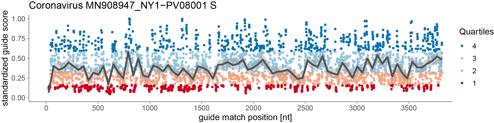

# Cas13design v0.2

Forked from the original [sanjanalab/cas13](https://gitlab.com/sanjanalab/cas13) GitLab repo.

This R software scores guide RNAs for the RNA-targeting CRISPR protein Cas13d to maximize target knockdown efficacy.

> **Performance note:** a review of the RNAhybrid scoring step and some
> updates to it (see [RNAHYBRID_BATCH_SPEEDUP.md](RNAHYBRID_BATCH_SPEEDUP.md))
> found:
> - 474x on raw RNAhybrid pairs (18.95s → 0.04s)
> - 5.4x – 12.7x on full real transcript runs (982 nt and 8,389 nt)
> - projected ~53x–1,144x at production concurrency, with one real 4.4 Mb
>   chunk going from ~28 hours to ~32 minutes
> - verified bit-for-bit correct against vanilla RNAhybrid (identical MFEs,
>   identical SHA-256 output)


## Background

The guide RNA efficacies are modeled using data from GFP, CD46, CD55, and CD71 mRNA tiling screens.
For more information, please refer to our recent manuscript:

Hans-Hermann Wessels\*, Alejandro Méndez-Mancilla\*, Xinyi Guo, Mateusz Legut, Zharko Daniloski, Neville E. Sanjana. (2020) 
[***Massively parallel Cas13 screens reveal principles for guide RNA design***.](https://doi.org/10.1038/s41587-020-0456-9) *Nature Biotechnology*, in press


## Install

To download and install the Cas13 guide RNA scoring software, please follow the instructions in Install.txt.
```
wget https://gitlab.com/sanjanalab/cas13/-/blob/master/Cas13designGuidePredictor/Cas13design.tar.gz
tar -xzf Cas13design.tar.gz
cd Cas13design
cat Install.txt
```
<br>
<br>


## Example: Cas13 guide RNAs to target the SARS-CoV-2 RNA genome

In the following section, I demonstrate how to predict guide RNA scores for custom target RNAs.
As an example, I choose to score guide RNAs to target the [Coronavirus SARS-CoV-2 strain USA/NY1-PV08001/2020](https://nextstrain.org/ncov?c=location&f_division=New%20York&r=country). The positive-sense RNA virus contains 10 genes (ORF1ab, S, ORF3a, E, M, ORF6, ORF7a, ORF8, N, ORF10). This strain was isolated from a patient in New York treated for COVID-19 after returning from Iran, which is one of several countries struggling with the [recent coronavirus pandemic](https://www.who.int/dg/speeches/detail/who-director-general-s-opening-remarks-at-the-media-briefing-on-covid-19---11-march-2020). Upon sequencing (PacBio, 20,000x coverage), the strain was found to have 3 nucleotide substitutions (G3243A, C25214T, G29027T) resulting in two amino acid mutations (N: A252S, ORF1a: G993S), as compared to the original Wuhan isolate of SARS-CoV-2. The GISAID accession ID for this SARS-CoV-2 isolate is EPI_ISL_414476 and we are grateful to Dr. Harm van Bakel at Mt. Sinai for making this data publically available.

To predict guide RNA scores for genes in the SARS-CoV-2 RNA genome, first change directories into the Cas13design folder.
The data directory contains the SARS-CoV-2 RNA genome sequences separated in single entry FASTA files.


```r
# navigate to your Cas13design installation
cd ~/path/to/Cas13design

# find USA/NY1-PV08001/2020 coronavirus sequences 
ls -ltr ./data/*fasta

```
<br>
<br>


### Predict guide RNA scores

Next, run the RfxCas13d_GuideScoring.R script by providing 3 required input arguments:
1. the target sequence as a single entry FASTA file
2. the model input data
3. a boolean variable (true/false), if you would like the guide RNA scores to be plotted relative to the input sequence.

```r

# Predict guide RNA scores for the USA/NY1-PV08001/2020 spike (S) gene
Rscript ./scripts/RfxCas13d_GuideScoring.R  ./data/MN908947_NY1-PV08001.S.fasta ./data/Cas13designGuidePredictorInput.csv true


```

If you run the script the first time, the R package installation may take several minutes to install needed packages.
Once Cas13design is fully installed, the run time scales with the FASTA input length.
The software extracts all information needed from the target sequence, including base probabilities, RNA-RNA hybridization energies, RNA target site accessibility or guide RNA folding.
The minimum length for a target sequence is 30 nucleotides. The total run time for the provided ~1000 nt test.fa example is about 2 min.
<br>
<br>
<br>


### Output

The output produced will have a few different elements and will be named named with the FASTA header information:
1. 	A fasta file with guide sequences (reverse complement to the target sequence). 
	The header includes the following information separated by underscores "_"
		the crRNA number (5' to 3') and match position (e.g. crRNA1156:1399-1425)
		standardized guide score
		rank
		quartile
2. 	A csv file containing all predicted guides
3.  if plot was set to TRUE, a pdf file is generated depicting the score destribution along the target transcripts

Guide scores range between a 0 - 1 interval, with **higher scores** being indicative for **higher predicted knock-down** efficacy. 


| GuideName        | Sequence               | Position  |Score  | Rank   | Standardized score | Quartile |
| -----------------|------------------------|-----------|------ |--------| :-----------------:| -------- |
| crRNA0742:780-802| CCACATAATAAGCTGCAGCACCA| 802       |1.659  | 0.9997 | 1                  |4         |
| crRNA0741:779-801| CACATAATAAGCTGCAGCACCAG| 801       |1.578  | 0.9994 | 1                  |4         |
| ...              | ...                    |...        |...    | ...    |...                 |...       |


<br>
<br>
<br>

<br>
<br>


## Bulk predictions

To predict guide RNA scores for all SARS-CoV-2 genes, one can use a simple wrapper. In this case, all jobs are send as individual jobs to a computation cluster.

```sh
# This will submit one job per fasta file in the directory ./data/
bash qsub_MakePredictions.sh ./data/
```


